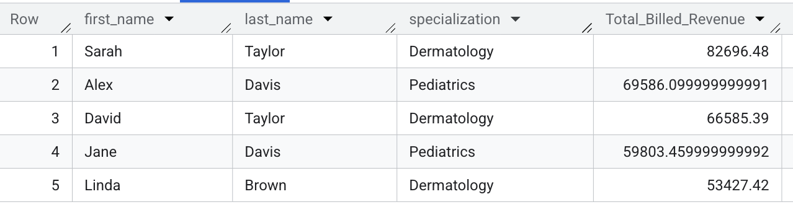

# Healthcare Operations Analysis in SQL (BigQuery)
An advanced SQL portfolio on Google BigQuery analyzing a healthcare database. Demonstrates Window Functions, CTEs, & Subqueries to solve business problems like physician revenue & aged receivables. Also features CASE statements, multi-table JOINs, & COALESCE for data cleaning & business logic.

## Project Objective
The goal of this project was to act as a Data Analyst for a hospital. I analyzed a multi-table relational database to identify key drivers of revenue, track billing efficiency, and understand patient-doctor interactions.

## The Dataset
The raw data for this project was sourced from the "Hospital Management Dataset" on Kaggle.

*   **Source:** https://www.kaggle.com/datasets/kanakbaghel/hospital-management-dataset
*   **Process:** I personally uploaded the CSV files to a private project in Google BigQuery, established the table relationships, and used BigQuery's SQL engine for all analysis.

## Comprehensive Database Schema
This analysis was performed on a multi-table relational database structure, utilizing the following five tables:

## 3. Database Schema

This analysis was performed on a multi-table relational database structure, utilizing the following five tables:

### Table: `patients` (Demographic Data)

| Column Name | Data Type (BigQuery) | Description |
| :--- | :--- | :--- |
| **`patient_id`** | `STRING` | **Primary Key (PK)**. Unique identifier for each patient. |
| `first_name` | `STRING` | Patient's first name. |
| `last_name` | `STRING` | Patient's last name. |
| `date_of_birth` | `DATE` | Patient's birth date. Used for age calculations. |
| `gender` | `STRING` | Biological gender (e.g., 'Male', 'Female', 'Other'). |
| `zip_code` | `STRING` | Patient's geographical location (used for regional analysis). |

### Table: `doctors` (Provider Data)

| Column Name | Data Type (BigQuery) | Description |
| :--- | :--- | :--- |
| **`doctor_id`** | `STRING` | **Primary Key (PK)**. Unique identifier for each doctor. |
| `first_name` | `STRING` | Doctor's first name. |
| `last_name` | `STRING` | Doctor's last name. |
| `specialization` | `STRING` | Medical field of expertise (e.g., 'Orthopedics', 'Cardiology'). |
| `years_of_experience` | `INT64` | Doctor's tenure/experience level. |

### Table: `appointments` (Operational/Scheduling Data)

| Column Name | Data Type (BigQuery) | Description |
| :--- | :--- | :--- |
| **`appointment_id`** | `STRING` | **Primary Key (PK)**. Unique identifier for the appointment record. |
| **`patient_id`** | `STRING` | **Foreign Key (FK)**. Links to the `patients` table. |
| **`doctor_id`** | `STRING` | **Foreign Key (FK)**. Links to the `doctors` table. |
| `appointment_date` | `TIMESTAMP` | The scheduled date and time of the appointment. |
| `status` | `STRING` | Appointment result (e.g., 'Completed', **'No-Show'**, 'Canceled'). |
| `wait_time_minutes` | `INT64` | Time patient waited (used for efficiency metrics). |

### Table: `treatments` (Clinical/Procedure Data)

| Column Name | Data Type (BigQuery) | Description |
| :--- | :--- | :--- |
| **`treatment_id`** | `STRING` | **Primary Key (PK)**. Unique identifier for the treatment performed. |
| **`appointment_id`** | `STRING` | **Foreign Key (FK)**. Links back to the `appointments` table. |
| `procedure_code` | `STRING` | Standard medical code (e.g., CPT/HCPCS) for the treatment. |
| `treatment_description` | `STRING` | Plain text description of the service rendered. |
| `duration_minutes` | `INT64` | Length of the procedure (used for cost/revenue weighting). |

### Table: `billing` (Financial Data)

| Column Name | Data Type (BigQuery) | Description |
| :--- | :--- | :--- |
| **`bill_id`** | `STRING` | **Primary Key (PK)**. Unique identifier for the bill. |
| **`treatment_id`** | `STRING` | **Foreign Key (FK)**. Links to the specific treatment performed. |
| `amount_due` | `FLOAT64` | Total amount charged for the service. |
| `payment_status` | `STRING` | Current status (e.g., 'Paid', 'Pending', **'Aged Receivables'**). |
| `billing_date` | `DATE` | The date the bill was generated. |
| `due_date` | `DATE` | The date payment is expected. |

## Key Analyses & Insights

### Analysis 1: Doctor Revenue Report

*   **Business Question:** Which doctors are generating the most revenue for the hospital?
*   **My SQL Query:**
    ```sql
    -- This query joins all 4 tables to connect doctors to billing
    SELECT
        d.first_name,
        d.last_name,
        d.specialization,
        SUM(b.amount) AS Total_Billed_Revenue
    FROM
        `bio_analytics.doctors` AS d
    JOIN
        `bio_analytics.appointments` AS a ON d.doctor_id = a.doctor_id
    JOIN
        `bio_analytics.treatments` AS t ON a.appointment_id = t.appointment_id
    JOIN
        `bio_analytics.billing` AS b ON t.treatment_id = b.treatment_id
    GROUP BY
        d.first_name, d.last_name, d.specialization
    ORDER BY
        Total_Billed_Revenue DESC
    LIMIT 5;
    ```
*   **Results & Insight:** The query successfully identified the top 5 earners. This insight would allow management to explore what high-performing doctors (e.g., in Dermatology) are doing differently.

    

