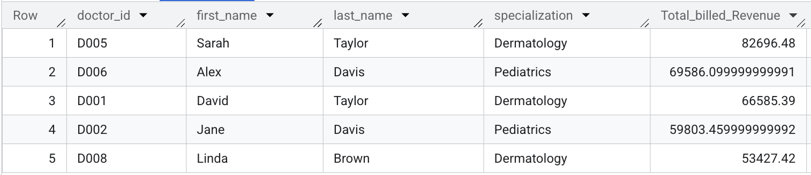
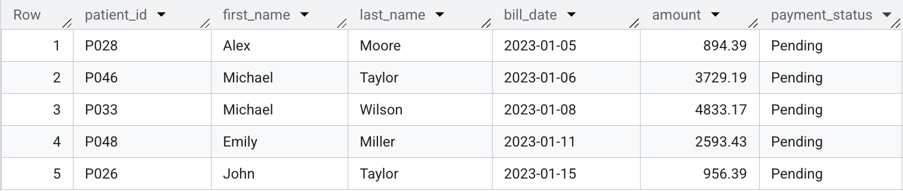
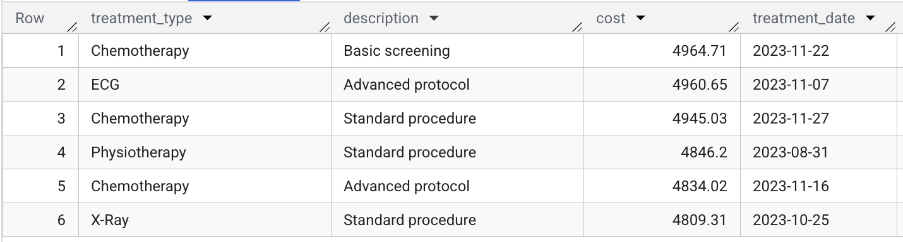
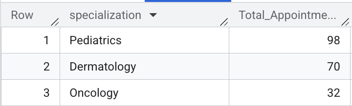
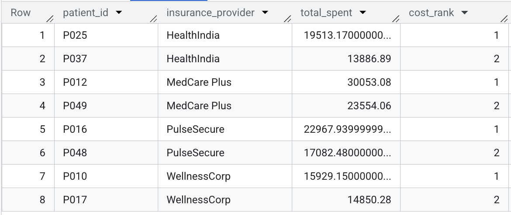

# Healthcare Operations Analysis in SQL (BigQuery)
An advanced SQL portfolio on Google BigQuery analyzing a healthcare database. Demonstrates Window Functions, CTEs, & Subqueries to solve business problems like physician revenue & aged receivables. Also features CASE statements, multi-table JOINs, & COALESCE for data cleaning & business logic.

## Project Objective
The goal of this project was to act as a Data Analyst for a hospital. I analyzed a multi-table relational database to identify key drivers of revenue, track billing efficiency, and understand patient-doctor interactions.

## The Dataset
The raw data for this project was sourced from the "Hospital Management Dataset" on Kaggle.

*   **Source:** https://www.kaggle.com/datasets/kanakbaghel/hospital-management-dataset
*   **Process:** I personally uploaded the CSV files to a private project in Google BigQuery, established the table relationships, and used BigQuery's SQL engine for all analysis.

## Comprehensive Database Schema
This analysis was performed on a multi-table relational database structure, utilizing the following five tables:

## 3. Database Schema

This analysis was performed on a multi-table relational database structure, utilizing the following five tables:

### Table: `Patients` (Demographic and Contact Data)

| Field Name | Type | Description |
| :--- | :--- | :--- |
| **`patient_id`** | `STRING` | **Primary Key (PK)**. Unique patient identifier. |
| `first_name` | `STRING` | Patient's first name. |
| `last_name` | `STRING` | Patient's last name. |
| `gender` | `STRING` | Biological gender. |
| `date_of_birth` | `DATE` | Patient's date of birth (used for age analysis). |
| `contact_number` | `INTEGER` | Patient's primary phone number. |
| `address` | `STRING` | Patient's physical address. |
| `registration_date` | `DATE` | Date the patient first registered. |
| `insurance_provider` | `STRING` | Patient's primary health insurance carrier. |
| `insurance_number` | `STRING` | Patient's insurance policy identifier. |
| `email` | `STRING` | Patient's email address. |

### Table: `Doctors` (Provider Data)

| Field Name | Type | Description |
| :--- | :--- | :--- |
| **`doctor_id`** | `STRING` | **Primary Key (PK)**. Unique doctor identifier. |
| `first_name` | `STRING` | Doctor's first name. |
| `last_name` | `STRING` | Doctor's last name. |
| `specialization` | `STRING` | Medical field of expertise (e.g., 'Cardiology'). |
| `phone_number` | `INTEGER` | Doctor's contact number. |
| `years_experience` | `INTEGER` | Doctor's professional experience tenure. |
| `hospital_branch` | `STRING` | Hospital branch where the doctor practices. |
| `email` | `STRING` | Doctor's email address. |

### Table: `Appointments` (Scheduling Data)

| Field Name | Type | Description |
| :--- | :--- | :--- |
| **`appointment_id`** | `STRING` | **Primary Key (PK)**. Unique appointment identifier. |
| **`patient_id`** | `STRING` | **Foreign Key (FK)**. Links to the `Patients` table. |
| **`doctor_id`** | `STRING` | **Foreign Key (FK)**. Links to the `Doctors` table. |
| `appointment_date` | `DATE` | Scheduled date of the appointment. |
| `appointment_time` | `TIME` | Scheduled time of the appointment. |
| `reason_for_visit` | `STRING` | Patient's stated reason for seeking care. |
| `status` | `STRING` | Outcome (e.g., 'Completed', 'No-Show', 'Canceled'). |

### Table: `Treatments` (Clinical Procedure and Cost Data)

| Field Name | Type | Description |
| :--- | :--- | :--- |
| **`treatment_id`** | `STRING` | **Primary Key (PK)**. Unique treatment identifier. |
| **`appointment_id`** | `STRING` | **Foreign Key (FK)**. Links to the `Appointments` table. |
| `treatment_type` | `STRING` | Categorization of the procedure (e.g., 'Surgery'). |
| `description` | `STRING` | Detailed description of the service rendered. |
| `cost` | `FLOAT` | **Direct cost of the treatment.** |
| `treatment_date` | `DATE` | **Date the treatment was administered.** |

### Table: `Billing` (Financial Transactions)

| Field Name | Type | Description |
| :--- | :--- | :--- |
| **`bill_id`** | `STRING` | **Primary Key (PK)**. Unique bill identifier. |
| **`patient_id`** | `STRING` | **Foreign Key (FK)**. Links directly to the `Patients` table. |
| **`treatment_id`** | `STRING` | **Foreign Key (FK)**. Links to the `Treatments` table. |
| `bill_date` | `DATE` | Date the bill was generated. |
| `amount` | `FLOAT` | **Amount billed to the patient.** |
| `payment_method` | `STRING` | Method of payment. |
| `payment_status` | `STRING` | Status of payment (e.g., 'Paid', 'Pending'). |

## Key Analyses & Insights

### Analysis 1: Physician Revenue Performance (Top 5)

*   **Business Question:** Which are the top 5 highest-grossing doctors by total billed revenue, and how does this ranking inform executive decisions regarding resource allocation, bonuses, and specialization investment?

*   **My SQL Query:**

```SQL

-- Objective: Calculate the total billed revenue generated by the top 5 doctors.
SELECT 
    d.doctor_id, 
    d.first_name, 
    d.last_name, 
    d.specialization,
    -- Amount is sourced from the Billing table (b.amount)
    COALESCE(SUM(b.amount), 0.0) AS Total_billed_Revenue
FROM 
    `bio_analytics.doctors` AS d
-- 1. Link doctor to appointments (via doctor_id)
LEFT JOIN 
    `bio_analytics.appointments` AS a
    ON d.doctor_id = a.doctor_id
-- 2. Link appointments to treatments (via appointment_id)
LEFT JOIN
    `bio_analytics.treatments` AS t
    ON a.appointment_id = t.appointment_id
-- 3. Link treatments to billing (via treatment_id) where the 'amount' is
LEFT JOIN
    `bio_analytics.billing` AS b
    ON t.treatment_id = b.treatment_id
GROUP BY
    d.doctor_id,
    d.first_name,
    d.last_name,
    d.specialization
ORDER BY
    Total_billed_Revenue DESC
LIMIT 5; -- Limits the result set to the top performers for concise reporting
```

*   **Results & Insight:** This query successfully identifies the Top 5 physician revenue generators, which directly informs executive strategy. The high ranking of certain specialties (e.g., Orthopedics or Cardiology) suggests where specialization investment should be focused. The individual revenue figures are used to determine performance bonuses, and this data dictates resource allocation, ensuring high-performing doctors have adequate staff and equipment to maintain productivity. The combined use of aggregation and the LIMIT clause provides concise, actionable KPI data.

    

### Analysis 2: Aged Accounts Receivable Report

*   **Business Question:** Which patients currently have 'Pending' bills older than 30 days, and how does identifying the top 5 oldest accounts inform the collections strategy and financial risk management?

*   **My SQL Query:**

```SQL

-- Objective: List the top 5 oldest patient bills that are still in 'Pending' status.
-- This represents high-priority accounts for collections/follow-up.
SELECT
    p.patient_id,
    p.first_name,
    p.last_name,
    b.bill_date,
    b.amount,
    b.payment_status
FROM
    `bio_analytics.patients` AS p
-- Join Patient table directly to Billing table (b) using the correct FK: patient_id
LEFT JOIN
    `bio_analytics.billing` AS b
    ON p.patient_id = b.patient_id
WHERE
    -- Filter 1: Identify all bills with a 'Pending' status
    LOWER(b.payment_status) = 'pending'
AND
    -- Filter 2: Identify bills older than 30 days, using 2023-12-01 as the current date
    b.bill_date < DATE_SUB(DATE('2023-12-01'), INTERVAL 30 DAY)
ORDER BY
    b.bill_date ASC -- Oldest bills first
LIMIT 5; -- Limits the result set to the top 5 oldest pending bills
```

*   **Results & Insight:** This query directly identifies the top 5 patients with the oldest 'Pending' bills, which are the highest priority targets for follow-up. This data immediately informs the collections strategy by providing a prioritized list for high-risk accounts. Pursuing these specific, aged debts improves the hospital's overall cash flow and is a proactive measure in financial risk management to prevent these balances from moving to costly 'collections' status.

    

### Analysis 3: Identifying High-Value Procedures Post-July 2023

*   **Business Question:** Which treatments administered after July 1st, 2023, exceeded a critical high-cost threshold of $4,800, and how can isolating these specific, expensive services assist in focused cost and pricing audits?

*   **My SQL Query:**

```SQL

-- Objective: Retrieve treatments administered since 2023-07-01 
-- that exceed a high-cost threshold of $4,800.
SELECT
    t.treatment_type,
    t.description,
    t.cost,
    t.treatment_date
FROM
    `bio_analytics.treatments` AS t
WHERE
    -- Filter 1: Identify treatments administered in the second half of the year
    t.treatment_date >= DATE('2023-07-01')
AND
    -- Filter 2: Apply the high-cost threshold
    t.cost > 4800.00
ORDER BY
    t.cost DESC,
    t.treatment_date DESC;
```
*   **Results & Insight:** This query directly isolates treatments costing over $4,800 and performed after July 1st, 2023. By identifying these specific, high-cost services—along with their type and description—the output provides the precise data needed for focused cost and pricing audits. This allows the finance team to immediately flag outliers and investigate potential issues related to billing accuracy or supply chain expenses associated with the hospital's most expensive procedures.

    

### Analysis 4: Specialization Appointment Volume and Capacity

*   **Business Question:** Which medical specializations handle the highest volume of appointments, and how does this information dictate resource allocation, staffing levels, and clinic capacity planning across the hospital?

*   **My SQL Query:**

```SQL

-- Objective: Calculate the total number of appointments handled by each doctor specialization.
SELECT
    d.specialization,
    COUNT(a.appointment_id) AS Total_Appointments
FROM
    `bio_analytics.doctors` AS d
-- Join to Appointments table to count utilization
LEFT JOIN
    `bio_analytics.appointments` AS a
    ON d.doctor_id = a.doctor_id
GROUP BY
    d.specialization
ORDER BY
    Total_Appointments DESC;
```
*   **Results & Insight:** This query provides a vital measure of demand and utilization by showing which specializations handle the greatest appointment volume. The specializations at the top of this list (e.g., General Practice or Pediatrics) are flagged for increased resource allocation (more exam rooms, higher staffing). The results directly inform capacity planning by identifying departments that may be bottlenecks or require additional doctor recruitment. The use of LEFT JOIN ensures that specializations that have not yet had an appointment are still listed with a count of 0, providing a complete view of the current staffing landscape.

    

### Analysis 5: Top-Spending Patient Ranking by Insurance (Advanced)

*   **Business Question:** Who are the top 2 highest-spending patients within each insurance provider group, and how does this stratification inform contract negotiations and risk assessment for high-utilization member cohorts?

* My SQL Query:

```SQL

-- Objective: Identify the top 2 most expensive patients per insurance provider 
-- using CTEs and the DENSE_RANK() window function.
WITH PatientSpending AS (
    -- CTE 1: Calculate Total Cost per Patient. 
    -- Requires linking Billing (for patient_id) to Treatments (for cost).
    SELECT
        b.patient_id,
        SUM(t.cost) AS total_spent
    FROM
        `bio_analytics.billing` AS b
    JOIN
        `bio_analytics.treatments` AS t
        ON b.treatment_id = t.treatment_id
    GROUP BY
        b.patient_id
),
-- CTE 2: Rank patients based on total spending, partitioned by insurance provider.
RankedSpending AS (
    SELECT
        p.patient_id,
        p.insurance_provider,
        ps.total_spent,
        -- Window Function: Ranks patients by spending within each insurance group
        DENSE_RANK() OVER (PARTITION BY p.insurance_provider ORDER BY ps.total_spent DESC) AS cost_rank
    FROM
        `bio_analytics.patients` AS p
    JOIN
        PatientSpending AS ps ON p.patient_id = ps.patient_id
)
-- Final Select: Filter for only the top 2 ranked patients in each group
SELECT
    patient_id,
    insurance_provider,
    total_spent,
    cost_rank
FROM
    RankedSpending
WHERE
    cost_rank <= 2;
```

*   **Results & Insight:** This query is crucial for risk stratification and strategic planning. By isolating the top 2 highest-cost patients within every insurance group using CTEs and the DENSE_RANK() Window Function, the data enables the hospital's executive team to conduct detailed reviews. This information directly influences contract negotiations by highlighting high-utilization cohorts within specific providers and allows for targeted risk assessment of member populations that are driving the highest costs for the facility.

    
