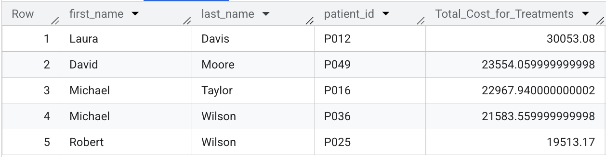

# Healthcare Operations Analysis in SQL (BigQuery)
An advanced SQL portfolio on Google BigQuery analyzing a healthcare database. Demonstrates Window Functions, CTEs, & Subqueries to solve business problems like physician revenue & aged receivables. Also features CASE statements, multi-table JOINs, & COALESCE for data cleaning & business logic.

## Project Objective
The goal of this project was to act as a Data Analyst for a hospital. I analyzed a multi-table relational database to identify key drivers of revenue, track billing efficiency, and understand patient-doctor interactions.

## The Dataset
The raw data for this project was sourced from the "Hospital Management Dataset" on Kaggle.

*   **Source:** https://www.kaggle.com/datasets/kanakbaghel/hospital-management-dataset
*   **Process:** I personally uploaded the CSV files to a private project in Google BigQuery, established the table relationships, and used BigQuery's SQL engine for all analysis.

## Comprehensive Database Schema
This analysis was performed on a multi-table relational database structure, utilizing the following five tables:

## 3. Database Schema

This analysis was performed on a multi-table relational database structure, utilizing the following five tables:

### Table: `Patients` (Demographic and Contact Data)

| Field Name | Type | Description |
| :--- | :--- | :--- |
| **`patient_id`** | `STRING` | **Primary Key (PK)**. Unique patient identifier. |
| `first_name` | `STRING` | Patient's first name. |
| `last_name` | `STRING` | Patient's last name. |
| `gender` | `STRING` | Biological gender. |
| `date_of_birth` | `DATE` | Patient's date of birth (used for age analysis). |
| `contact_number` | `INTEGER` | Patient's primary phone number. |
| `address` | `STRING` | Patient's physical address. |
| `registration_date` | `DATE` | Date the patient first registered. |
| `insurance_provider` | `STRING` | Patient's primary health insurance carrier. |
| `insurance_number` | `STRING` | Patient's insurance policy identifier. |
| `email` | `STRING` | Patient's email address. |

### Table: `Doctors` (Provider Data)

| Field Name | Type | Description |
| :--- | :--- | :--- |
| **`doctor_id`** | `STRING` | **Primary Key (PK)**. Unique doctor identifier. |
| `first_name` | `STRING` | Doctor's first name. |
| `last_name` | `STRING` | Doctor's last name. |
| `specialization` | `STRING` | Medical field of expertise (e.g., 'Cardiology'). |
| `phone_number` | `INTEGER` | Doctor's contact number. |
| `years_experience` | `INTEGER` | Doctor's professional experience tenure. |
| `hospital_branch` | `STRING` | Hospital branch where the doctor practices. |
| `email` | `STRING` | Doctor's email address. |

### Table: `Appointments` (Scheduling Data)

| Field Name | Type | Description |
| :--- | :--- | :--- |
| **`appointment_id`** | `STRING` | **Primary Key (PK)**. Unique appointment identifier. |
| **`patient_id`** | `STRING` | **Foreign Key (FK)**. Links to the `Patients` table. |
| **`doctor_id`** | `STRING` | **Foreign Key (FK)**. Links to the `Doctors` table. |
| `appointment_date` | `DATE` | Scheduled date of the appointment. |
| `appointment_time` | `TIME` | Scheduled time of the appointment. |
| `reason_for_visit` | `STRING` | Patient's stated reason for seeking care. |
| `status` | `STRING` | Outcome (e.g., 'Completed', 'No-Show', 'Canceled'). |

### Table: `Treatments` (Clinical Procedure and Cost Data)

| Field Name | Type | Description |
| :--- | :--- | :--- |
| **`treatment_id`** | `STRING` | **Primary Key (PK)**. Unique treatment identifier. |
| **`appointment_id`** | `STRING` | **Foreign Key (FK)**. Links to the `Appointments` table. |
| `treatment_type` | `STRING` | Categorization of the procedure (e.g., 'Surgery'). |
| `description` | `STRING` | Detailed description of the service rendered. |
| `cost` | `FLOAT` | **Direct cost of the treatment.** |
| `treatment_date` | `DATE` | **Date the treatment was administered.** |

### Table: `Billing` (Financial Transactions)

| Field Name | Type | Description |
| :--- | :--- | :--- |
| **`bill_id`** | `STRING` | **Primary Key (PK)**. Unique bill identifier. |
| **`patient_id`** | `STRING` | **Foreign Key (FK)**. Links directly to the `Patients` table. |
| **`treatment_id`** | `STRING` | **Foreign Key (FK)**. Links to the `Treatments` table. |
| `bill_date` | `DATE` | Date the bill was generated. |
| `amount` | `FLOAT` | **Amount billed to the patient.** |
| `payment_method` | `STRING` | Method of payment. |
| `payment_status` | `STRING` | Status of payment (e.g., 'Paid', 'Pending'). |

## Key Analyses & Insights

### Analysis 1: Physician Revenue Performance

*   **Business Question:** Which doctors and specializations drive the highest total billed revenue, and how does this information inform resource allocation and financial forecasting for the hospital?
*   **My SQL Query:**
 ```sql
-- Objective: Calculate the total billed revenue generated by each doctor, 
-- including doctors who have not generated any revenue (using LEFT JOIN).
SELECT 
    d.doctor_id, 
    d.first_name, 
    d.last_name, 
    d.specialization,
    -- Use COALESCE to display 0.0 instead of NULL for doctors with no revenue
    COALESCE(SUM(b.amount), 0.0) AS Total_billed_Revenue
FROM 
    `bio_analytics.doctors` AS d
-- 1. Link doctors to appointments
LEFT JOIN 
    `bio_analytics.appointments` AS a
    ON d.doctor_id = a.doctor_id
-- 2. Link appointments to treatments performed
LEFT JOIN
    `bio_analytics.treatments` AS t
    ON a.appointment_id = t.appointment_id
-- 3. Link treatments to billing records (CORRECTED JOIN KEY: treatment_id)
LEFT JOIN
    `bio_analytics.billing` AS b
    ON t.treatment_id = b.treatment_id
GROUP BY
    d.doctor_id,
    d.first_name,
    d.last_name,
    d.specialization
ORDER BY
    Total_Billed_Revenue DESC;
```
*   **Results & Insight:** This query generates the foundation for the hospital's financial performance reports. By calculating the Total_Billed_Revenue and ordering the results, we can immediately identify high-impact specialties and individual top earners (e.g., if Dermatology generates 40% of revenue, management should prioritize its resources). The use of LEFT JOIN ensures that doctors who have yet to generate revenue (e.g., new hires) are still included in the report with a NULL or zero revenue value, providing a complete picture for management rather than just showing active accounts.

    

### Analysis 2: Patient Lifetime Cost & Utilization

*   **Business Question:** What are the top 5 highest-cost patients by cumulative billed treatments, and how can this metric be used to identify high-utilization patients for targeted case management or risk stratification?

*   **My SQL Query:**
```SQL

-- Objective: Calculate the total lifetime billed cost for every patient, 
-- limited to the top 5 for reporting purposes.
SELECT
    p.first_name,
    p.last_name,
    p.patient_id,
    -- Using b.amount as the billed financial value
    COALESCE(SUM(b.amount), 0.0) AS Total_Cost_for_Treatments
FROM 
    `bio_analytics.patients` AS p
-- 1. Link patient to appointments
LEFT JOIN
    `bio_analytics.appointments` AS a
    ON p.patient_id = a.patient_id
-- 2. Link appointment to treatment
LEFT JOIN
    `bio_analytics.treatments` AS t
    ON a.appointment_id = t.appointment_id
-- 3. Link treatment to billing (where the cost data is)
LEFT JOIN
    `bio_analytics.billing` AS b
    ON t.treatment_id = b.treatment_id
GROUP BY
    p.patient_id,
    p.first_name,
    p.last_name
ORDER BY
    Total_Cost_for_Treatments DESC
LIMIT 5; 
```
Results & Insight: This query successfully identifies the Top 5 highest-cost patients, providing management with an immediate list for risk analysis. This cohort often represents patients with complex or chronic care needs, and these costs directly impact the hospital's budget. The query demonstrates the ability to join four tables correctly, aggregate data using SUM(), and use the LIMIT clause for professional, summarized reporting. This is a foundational step for implementing cost-reduction strategies like disease management or preventative care programs.
    

